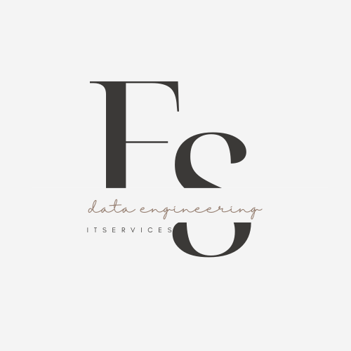

# Python Project Template
> List of tools and configurations I like to use to start a new Python project

This is a template for a Python project. It is a list of tools and configurations I like to use to start a new Python project. It is a work in progress and I will be adding more tools and configurations along the way.

## Installing / Getting started

To get this project started, follow these steps:

```shell

```

Here you should say what actually happens when you execute the code above.

### Initial Configuration

Some projects require initial configuration (e.g. access tokens or keys, `npm i`).
This is the section where you would document those requirements.

## Features

What's all the bells and whistles this project can perform?
* What's the main functionality
* You can also do another thing
* If you get really randy, you can even do this

Your job is to

* tell them what it is (with context)
* show them what it looks like in action
* show them how they use it
* tell them any other relevant details

## Contributing

If you'd like to contribute, please fork the repository and use a feature
branch. Pull requests are warmly welcome.

## Tools

This project uses the following tools:

* [Python](https://www.python.org/)
* [Git](https://git-scm.com/)
* [Poetry](https://python-poetry.org/)
* [Black](https://black.readthedocs.io/en/stable/)
* [Flake8](https://flake8.pycqa.org/en/latest/)
* [Pytest](https://docs.pytest.org/en/stable/)
* [Sphinx](https://www.sphinx-doc.org/en/master/)
* [Make](https://www.gnu.org/software/make/)
* [FastAPI](https://fastapi.tiangolo.com/)

## Licensing

One really important part: Give your project a proper license. Here you should
state what the license is and how to find the text version of the license.
Something like:

"The code in this project is licensed under MIT license."
